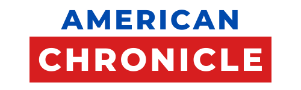
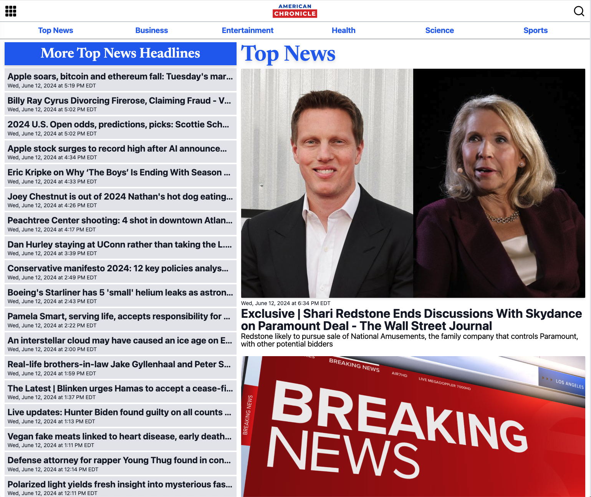

    

## Description
Introducing "American Chronicle" - the ultimate platform for people interested in connecting with news channels and articles from the United States! It gathers news from multiple trusted source and presents them in a user-friendly applicaton. 

## Table of Contents
- [Installation](#installation)
- [Usage](#usage)
- [Motivation](#motivation)
- [Future Development](#future-development)
- [Technologies](#technologies)
- [Application](#application)
- [Screenshots](#screenshots)
- [Contributors](#contributors)
- [License](#license)
## Installation
**Packages required to run locally:**
|Packages & Documentation                                  | Installation     |
|---------------------------------------------------------|-------------------|
|[MongoDB](https://www.npmjs.com/package/mongodb)         |`npm i mongodb`    |
|[Express](https://www.npmjs.com/package/express)         |`npm i express`    |
|[React](https://www.npmjs.com/package/react)             |`npm i react`      |
|[Eslint](https://www.npmjs.com/package/eslint)           |`npm i eslint`     |
|[Vite](https://www.npmjs.com/package/vite)               |`npm i vite`       |
|[MongoDB](https://www.npmjs.com/package/mongodb)         |`npm i mongodb`    |
|[Express](https://www.npmjs.com/package/express)         |`npm i express`    |
|[React](https://www.npmjs.com/package/react)             |`npm i react`      |
|[Eslint](https://www.npmjs.com/package/eslint)           |`npm i eslint`     |
|[Vite](https://www.npmjs.com/package/vite)               |`npm i vite`       |

## Usage
* npm i
* npm i --save mapbox-gl
* npm run seed
* npm run develop

## Motivation
The motivation behind this project was to develop a comprehensive and innovative news application tailored to the diverse landscape of the United States. Recognizing the need for reliable, insightful, and engaging news coverage in an era of information overload, the project aimed to provide a platform that not only aggregated news but also fostered community, dialogue, and engagement among users. Ultimately, the goal was to create a digital ecosystem that informed and inspired users across the breadth and depth of American society.

## Future Development
* Allow user to add profile picture.
* Implement feature using Mapbox API with pin points that updates daily headlines.  This feature would be accessed in the sidebar.
* Allow users to have open dialog on news headline by leaving comments and replies.

## Technologies
1. MongoDB
2. Express
3. React
4. Node JS

## Screenshots
## Screenshots

    

    

    

## Application
[Link of deployed application](https://american-chronicle-70778c15f55a.herokuapp.com//)
## Screenshots
Screenshot of the deployed application

## Contributors

Katrina: [GitHub](https://github.com/katgucilatar) -- [LinkedIn](https://www.linkedin.com/in/katrina-gucilatar-59983217b/) -- [Email](katgucilatar@outlook.com)

Illir: [GitHub](https://github.com/IlirHajdari) -- [Email](ilir.hajdari111@gmail.com)

Laura: [GitHub](https://github.com/LJJordan124) -- [LinkedIn](https://www.linkedin.com/in/laura-jordan-510412241/) -- [Email](jordan3313.lj@gmail.com)
## License

